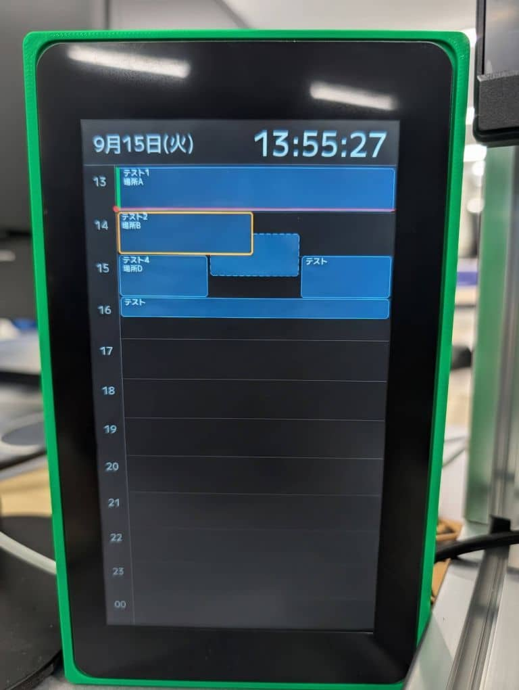
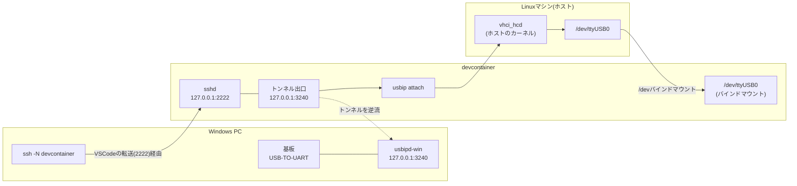

# schedule-viewer-esp32s3

Waveshare ESP32-S3-Touch-LCD-7B(7インチ1024×600 IPS、RGB565パラレル16bit)の
LCDに、Outlook予定表を12時間分のタイムライン表示するビューアです。
基板がWi-Fiで予定配信サーバのREST APIを叩き、返ってきたJSONをLCDに描画します。
基板は90度回して縦置き(論理600×1024)で使います。

> **通信方式を変更しました。** 以前はPCとのUSBシリアルのみで完結し、Wi-Fi/Bluetoothを
> 使わない構成でしたが、サーバから直接取得する方式へ移行しました。現在はWi-Fi(STA)と
> HTTPSを使用します。Bluetoothは引き続き使用しません。
> USBシリアル経由の受信経路(`serial_link` / `protocol` / `pc_python`)は、サーバ到達性が
> 実機で確認できるまでフォールバックとして残してあります。

## 実機イメージ



> この画像はM5Paper版のものです。ESP32-S3版の実機イメージは撮り直しが必要です。

## 構成

```
.
├── main/                    # ESP32-S3-Touch-LCD-7B ファームウェア
│   ├── main.cpp             # app_main()、初期化→Wi-Fi接続→取得→描画のループ
│   ├── wifi_link.cpp/.h     # Wi-Fi(STA / WPA2-PSK)接続
│   ├── http_client.cpp/.h   # HTTPS GET(esp_http_client + esp_crt_bundle)
│   ├── json_parser.cpp/.h   # cJSONでレスポンスをEventへ変換
│   ├── secrets.h.example    # SSID/パスワード/URLの雛形(実体secrets.hは追跡外)
│   ├── serial_link.cpp/.h   # UART0(115200bps)の行単位送受信 ※フォールバック
│   ├── protocol.cpp/.h      # PC↔デバイス間のテキストプロトコル ※フォールバック
│   ├── schedule.cpp/.h      # 予定データの保持
│   ├── display.cpp/.h       # LCD描画(タイムラインUI)。スプライトへ描いてフレームバッファへ転送
│   ├── lcd_panel.cpp/.h     # esp_lcd RGBパネル初期化 + LovyanGFXのLGFX_Deviceラッパー
│   ├── io_ext.cpp/.h        # IO拡張チップ(I2C 0x24)。バックライトのON/OFFとPWM調光
│   ├── font_ttf.cpp/.h      # FreeTypeでfontパーティション上のTTFを描画
│   ├── text_util.cpp/.h     # 件名・場所の正規化(全角→半角など)
│   ├── time_util.h          # UTC/JST変換、ISO8601/HTTP Dateのパース
│   ├── CMakeLists.txt
│   └── idf_component.yml    # LovyanGFX(git依存)、espressif/freetype への依存
├── fonts/                   # fontパーティションへ書き込むTTF(MPLUS1-Medium.ttf)とOFL.txt
├── docs/
│   └── spec.md              # 仕様(画面、表示条件、プロトコル、時刻)
├── pc_python/
│   └── scheduler_sender.py  # Outlook予定取得 → シリアル送信
├── .devcontainer/           # ESP-IDF v5.5 の開発コンテナ
├── CMakeLists.txt           # ESP-IDFプロジェクトのルート
├── partitions.csv           # パーティションテーブル(16MB / factory 6MB / fontパーティション2MB)
└── sdkconfig.defaults       # Kconfigの初期値(esp32s3ターゲット、PSRAM Octal有効)
```

RTCチップは搭載していません。時刻はサーバ応答のみに追従します(詳細は`docs/spec.md`)。

## 仕様

画面の内容、表示する予定の条件、通信プロトコル、時刻の扱いは[docs/spec.md](docs/spec.md)にまとめてある。

## 設定(secrets.h)

SSID・パスワード・エンドポイントURLは`main/secrets.h`に置きます。資格情報を含むため
`.gitignore`で追跡対象から外してあり、リポジトリには雛形の`main/secrets.h.example`だけが入っています。

```bash
cp main/secrets.h.example main/secrets.h
# main/secrets.h を編集して自分の環境の値を入れる
```

| マクロ | 意味 |
|---|---|
| `WIFI_SSID` | 接続先APのSSID(WPA2-PSK) |
| `WIFI_PASSWORD` | 同パスワード |
| `SCHEDULE_URL` | 予定取得APIのURL。https必須 |
| `POLL_INTERVAL_SEC` | ポーリング間隔(秒)。既定600。壁時計のこの間隔の境界で取得する |

## デバイス側(ESP32-S3-Touch-LCD-7B) ファームウェア

**ESP-IDF v5.5** で書かれています(Arduino / PlatformIOは使いません)。
表示は[esp_lcd](https://docs.espressif.com/projects/esp-idf/en/v5.5/esp32s3/api-reference/peripherals/lcd/index.html)の
RGBパネルドライバがパネルを駆動し、その上を[LovyanGFX](https://github.com/lovyan03/LovyanGFX)
(1.2.28、ESPコンポーネントレジストリに無いため`idf_component.yml`にgit依存)が
`LGFX_Device`として包みます(`main/lcd_panel.cpp`)。RTCチップは搭載していません。

> ESP-IDF v6.0ではLovyanGFXが依存するレガシーI2Cドライバ(`driver/i2c.h`)が削除されているため、
> 意図的にv5系へ固定しています。バージョンを上げるときは`main/idf_component.yml`と
> `.devcontainer/docker-compose.yml`の`DOCKER_TAG`の両方を揃えて変更してください。

### 必要環境

- [Visual Studio Code](https://code.visualstudio.com/)
- VSCode拡張機能 [Dev Containers](https://marketplace.visualstudio.com/items?itemName=ms-vscode-remote.remote-containers)
- Docker(Dev ContainersはLinux上のDockerで動かす想定です。Windows + Docker Desktop + WSL2でも
  動きますが、その場合は基板をUSB/IPで別途取り込む必要があります。詳細は後述の
  「実機接続(USB/IP)」を参照してください)

ツールチェーンはすべてコンテナ内(`espressif/idf:v5.5`ベース)に入るため、
ホスト側にESP-IDFやPythonを入れる必要はありません。

### ビルド/書き込み

1. VSCodeでこのフォルダを開き、`Dev Containers: Reopen in Container` を実行する
   - 初回作成時に`.devcontainer/post-create.sh`が`idf.py set-target esp32s3`まで済ませ、
     `managed_components/`(LovyanGFX / espressif/freetype)を取得します
2. コンテナ内のターミナルでビルドする

```bash
cd /workspaces
. /opt/esp/idf/export.sh >/dev/null 2>&1   # 非対話シェルではPATHにidf.pyが無いので必須
idf.py build
```

3. 書き込みとログ取得を行う → 後述の「[書き込みとログ取得(Windows側で実行)](#書き込みとログ取得windows側で実行)」を参照

**日本語フォントは`font`パーティション(0x610000、2MB)へ生のTTFとして書き込みます。**
ビルド時に`fonts/MPLUS1-Medium.ttf`が`build/font.bin`へコピーされ、`build/flash_args`にも
自動で含まれるため、`idf.py flash`(またはWindows側の書き込み)を実行すれば他のイメージと
一緒に書き込まれます。**初回は必ずフォントを含めて書き込んでください**
(フォントが無い状態では起動が止まります)。

基板が**devcontainerと同じマシンにUSB接続されている場合**に限り、従来どおり
コンテナ内から直接書き込めます。

```bash
idf.py -p /dev/ttyUSB0 flash monitor
```

基板がWindows PCに挿さっていてUSB/IPで取り込んでいる場合、この方法は
**1回の書き込みに6分以上かかります**(理由は後述)。Windows側で実行する手順を使ってください。

VSCodeのESP-IDF拡張のステータスバー(ビルド/フラッシュ/モニタ)からも同じことができます。
ターゲット・ポート・書き込み方式(UART)は`.devcontainer/devcontainer.json`と
`.vscode/settings.json`で設定済みです。

> **デバッグ**: ESP32-S3自体はUSB-JTAGを内蔵していますが、この基板のネイティブUSBポートで
> JTAGが使えるかは**未検証**です。切り分けは`ESP_LOG*`と`idf.py monitor`で行います。

### 書き込みとログ取得(Windows側で実行)

基板がWindows PCに挿さっている構成では、**書き込みとシリアル監視をWindows側で行います**。
ビルドはこれまでどおりdevcontainer内です。書き込みチップは`esp32s3`です。

> **COMポート番号は新基板では未確定**です。`bash tools/win.sh ports`でWindows側の
> COMポート一覧を確認してから使ってください。またUSB-TO-UARTの自動リセット(DTR/RTS)が
> 効くか(BOOTボタン操作なしで書き込めるか)は**未検証**です。

**なぜUSB/IP経由で書き込まないか**

以下はM5Paper(cp210xブリッジ)で実測した内容です。新基板のUSB-TO-UARTブリッジチップは
未確認ですが、USB/IPのURBサイズに起因する制約は一般的な傾向のため、目安として残しています。

cp210xドライバは書き込みURBが256バイトで、同時に発行できるのは2本
(kernelの`usb_serial_port`の`write_urbs[2]`、`cp210x.c`の`.bulk_out_size = 256`)。
USB/IPはURB1個をTCPの要求/応答1組に載せるため、**512バイト/往復**が上限になります。
この経路の1往復は実測で中央値112.7ms(ローカルUSBは0.12ms)なので、実効約4.4KB/s。
圧縮後1.76MBのイメージに6分以上かかります(**実測367秒 / esptool表示51.5kbit/s**)。
シリアル線は460800bpsで38秒相当しか使っておらず、**ボーレートを上げても改善しません**。
受信も同じ制約(約4.4KB/s)で、115200bpsの起動ログは取りこぼします。

**手順: Windows側で1回起動しておき、以後の書き込みはコンテナ側から行う**

devcontainerからWindows PCへ発信することはできないので、**Windows側から張ったsshの
標準出力を指示の通り道として使います**。Windows側で待ち受けポートを開くことも、
何かをインストールすることもありません。

1. Windows: 初回だけ2つのファイルを取得する(任意のフォルダで構いません)。

```powershell
scp devcontainer:/workspaces/.devcontainer/win-agent.ps1 .
scp devcontainer:/workspaces/.devcontainer/win-agent.bat .
```

2. Windows: 開発を始めるたびに`win-agent.bat`を実行し、**開いたままにする**。
   従来の`ssh -N devcontainer`の置き換えです。

```
win-agent.bat
```

`win-agent.bat`は`win-agent.ps1`を起動し直し続けるだけのループです。ps1は自己更新すると
**終了するだけ**なので、次の周回でbatが新しい内容を起動します。異常終了しても同じく復帰します。
したがって`scp`は初回の1回だけで、以後の修正は自動で反映されます。
batが`-ExecutionPolicy Bypass`を付けるのは、既定では`.ps1`の実行が拒否されるためです
(そのプロセス限りで、PCの設定は変更しません)。

> **文字コードの要件**(3回つまずいた箇所です)
>
> | ファイル | 読み手 | 必要な形式 |
> |---|---|---|
> | `win-agent.ps1` / `flash.ps1` | Windows PowerShell 5.1 | UTF-8 **BOM付き**(BOMが無いとCP932として読まれ日本語が壊れ、構文エラーになる) |
> | `win-agent.bat` | cmd.exe | **ASCIIのみ + CRLF + BOM無し**(cmd.exeはOEMコードページで読む。BOMは1行目を壊す) |
> | `tools/*.sh` | コンテナのbash | UTF-8 BOM無し + LF |
>
> `.bat`のCRLFは`.gitattributes`の`*.bat text eol=crlf`で担保しています。

> **USB/IPは通常使いません。** そのため`/dev/ttyUSB0`は存在しないのが正常です。
> 使いたい場合は`~/.ssh/config`に`RemoteForward 3240 127.0.0.1:3240`を戻すか、
> `ssh -N -R 3240:127.0.0.1:3240 devcontainer`を別途張ってください。
> ただし**この行を常設すると`ssh`/`scp`のたびに`remote port forwarding failed`が出ます**。

3. 以後、書き込みは**devcontainer内から**実行します。ビルド・ステージング・
   USB/IPのデタッチ・書き込み・リセット・ログ取得まで通しで行います。
   `--after hard_reset`だけではアプリが起動しないことがあるため、書き込み成功後に
   `esptool run`で明示的なリセットを発行してからログ取得に入ります(失敗しても
   致命的にはせず、警告を出して続行します)。

```bash
bash tools/flash.sh                 # ビルドから書き込み、その後180秒ぶんログを取る
bash tools/flash.sh --no-build      # ビルド済みの成果物で書き込む
bash tools/flash.sh --port COM12 --baud 460800 --monitor 0
```

個別の操作は`tools/win.sh`で直接呼べます。

| コマンド | Windows側で実行される内容 |
|---|---|
| `bash tools/win.sh sync` | `scp`で転送物を取得 |
| `bash tools/win.sh ports` | COMポートの一覧(`serial.tools.list_ports`) |
| `bash tools/win.sh probe port=COM11` | `esptool chip_id`(書き換えは起きない) |
| `bash tools/win.sh reset port=COM11` | `esptool run`でアプリを起動させる(書き換えは起きない) |
| `bash tools/win.sh flash port=COM11 baud=921600` | 書き込み |
| `bash tools/win.sh monitor port=COM11 sec=180` | シリアルログの取得 |
| `bash tools/win.sh restart` | `win-agent.ps1`を自己更新して再起動 |

**`win-agent.ps1`が実行するのはこの6つだけです。** コンテナから渡せるのはポート番号などの
パラメータのみで、書式(`COM<数字>`、数値)も検証します。任意のコマンドは実行しません。

処理の流れは次のとおりです。

| 順 | 場所 | 動作 |
|---|---|---|
| 1 | コンテナ | `tools/flash.sh`が`idf.py build` → `tools/stage-winflash.sh` → USB/IPのデタッチ |
| 2 | コンテナ | `tools/win.sh`が要求1行をFIFO(`.win-request`)へ書く |
| 3 | コンテナ | `tools/win-agent.sh`がその行をsshの標準出力へ中継する |
| 4 | Windows | `win-agent.ps1`が受け取り、該当する操作だけを実行する |
| 5 | コンテナ | 出力が`logs/win/<ID>.log`へ、書き込み・監視のログは`logs/flash.log` / `logs/monitor.log`へ流れてくる |
| 6 | コンテナ | `tools/win.sh`が`=== EXIT rc=… ===`を検出し、終了コードを引き継いで終わる |

**Windows側に置くもの**

| パス | 内容 | 消えたら |
|---|---|---|
| 任意のフォルダ | `win-agent.bat`と`win-agent.ps1`(初回に`scp`した場所。ps1は自己更新でここが書き換わる) | `scp`で取り直す |
| `%LOCALAPPDATA%\m5flash\lib\` | `esptool` / `serial`(pyserial) / `intelhex`のコピー(1.6MB) | 次回`sync`で取り直す |
| `%LOCALAPPDATA%\m5flash\build\` | `flash_args`と`.bin`一式(2.8MB) | 毎回取り直す |
| `%LOCALAPPDATA%\m5flash\logs\` | ログの控え | 同じ内容が`logs/`にあるので実害なし |

これらは純Pythonなので`pip install`は不要です。`PYTHONPATH`はそのPowerShellウィンドウ限りで、
site-packages・レジストリ・`PATH`・ドライバには一切触れません。

**ログ**

書き込みログとシリアルログは、`tools/win_flash.py`が**1行ずつsshでdevcontainerへ流し込みます**
(終了時の一括アップロードはしません)。

| ファイル | 内容 |
|---|---|
| `logs/build.log` | コンテナ内のビルドログ |
| `logs/flash.log` | esptoolの出力。末尾に必ず`=== FLASH RESULT rc=<終了コード> ===` |
| `logs/monitor.log` | シリアルログ。`=== MONITOR START/END ===`で区切られる |
| `logs/win.log` | PowerShellのtranscript(冗長な控え。終了時にコピー) |

`logs/`はgit追跡外です。sshが切れた間の行はWindows側の控えに退避し、再接続時に
`=== RESYNC ===`を付けて送り直します(重複は許容、欠落は許容しない方針)。

### 実機接続(USB/IP、SSHリバースポートフォワード方式)

基板を挿すWindows PCと、devcontainerが動くLinuxマシンが別マシンの場合、
USB/IPで基板のUSB-TO-UARTポート(ブリッジチップ名は未確認)をネットワーク越しに取り込みます。

> **通常の書き込みには使いません。** 上記のとおり書き込みは6分以上かかり、ログも
> 取りこぼすため、通常は「書き込みとログ取得(Windows側で実行)」の手順を使ってください。
> USB/IPが要るのは、コンテナ内に`/dev/ttyUSB0`を生やして`idf.py monitor`などを
> 直接使いたい場合だけです。この節はその手順として残しています。
>
> なお`win-agent.ps1`は`~/.ssh/config`の`RemoteForward 3240`をそのまま使うので、
> **`ssh -N devcontainer`の代わりになります**。両方を同時に起動しないでください
> (3240が衝突します)。
devcontainerからWindows PCへ向かう通信はネットワークポリシー上許可されていないため、
**Windows側からdevcontainer内のsshdへ張るSSHにリバースポートフォワードを乗せ、
通信の向きを反転させています**。そのsshdへはVSCodeのポート転送(2222)経由で到達します。



`usbip attach`はdevcontainer内で実行します。attachの実体である`vhci_hcd`は
ホストLinuxのカーネルモジュールなので、デバイスはホストの`/dev`に生え、
既存の`/dev`バインドマウント(`docker-compose.yml`)でコンテナからも見えます。

| 場所 | 役割(何が待ち受け、何がどこへ繋ぐか) | 初回1回だけ | 毎回 |
|---|---|---|---|
| Windows | usbipd-winが基板を`127.0.0.1:3240`で共有する | usbipd-win導入 + `usbipd bind` | 基板を挿す + `ssh -N devcontainer` |
| VSCode | コンテナのsshd(2222)をWindowsのlocalhostへ転送する | 設定済み(`devcontainer.json`) | devcontainerを開く |
| devcontainer | sshdが2222で待ち受け、逆トンネルの出口3240を受ける。`usbip attach`もここで実行 | 設定済み(`Dockerfile` / `docker-compose.yml`) | `usb-attach.sh attach` |
| ホストLinux | `vhci_hcd`(attachの実体)。`/dev/ttyUSB0`が生える | `modprobe vhci-hcd`の永続化 | なし |

副次的なメリットとして、Windows側のファイアウォールでTCP 3240を開ける必要が
無くなります。usbipd-winはlocalhostからの接続だけ受ければよいので、
「同一ネットワークの誰でも基板を掴める」というリスクが構造的に消えます。

**事前準備(1回だけ)**

1. ホストLinux: `vhci_hcd`を読み込む(attachの実体はホストのカーネル)。

```bash
echo vhci-hcd | sudo tee /etc/modules-load.d/vhci-hcd.conf
sudo modprobe vhci-hcd
```

2. Windows: [usbipd-win](https://github.com/dorssel/usbipd-win)をインストールする
   (`winget install usbipd`)。`winget`が使えない環境では、MSIを別マシンで取得して
   Windowsへ持って行き実行します(管理者権限が要るのはここだけです)。
   usbipd-winはWindowsサービスとして常駐し、TCP 3240でlistenします。
3. Windows: 公開鍵を`.devcontainer/authorized_keys`に登録する。
   既存の鍵を流用する場合は`ssh-keygen -y -f <秘密鍵>`で公開鍵を導出できます。

> `authorized_keys`は開発者ごとに異なるため`.gitignore`で除外しています。
> **clone直後は存在しないので、devcontainerを開く前に作成してください。**
> 無い状態で開くとDockerが同名のディレクトリを作ってしまい、sshdが鍵を読めません
> (その場合はディレクトリを消してファイルを作り、コンテナを開き直します)。
>
> ```bash
> ssh-keygen -y -f ~/.ssh/id_rsa >> .devcontainer/authorized_keys
> ```
>
> このファイルはコンテナへ**ファイル単位でbind**しています(inode固定)。
> rename方式で保存するエディタや`sed -i`では**コンテナ側に反映されません**。
> 追記`>>`か上書き`>`のリダイレクトで編集してください。

4. Windows: `C:\Users\<ユーザー名>\.ssh\config`にdevcontainer向けのエントリを
   **既存エントリとは別のブロックで**追加する。

```
Host devcontainer
    HostName 127.0.0.1
    Port 2222
    User ubuntu
    IdentityFile C:\Users\<ユーザー名>\.ssh\id_rsa
    UserKnownHostsFile NUL
    StrictHostKeyChecking no
    ServerAliveInterval 30
    RemoteForward 3240 127.0.0.1:3240
```

`HostName 127.0.0.1`なのは、接続先がVSCodeによって自PCのlocalhostへ転送されている
コンテナのsshdだからです。`known_hosts`を無効にしているのは、コンテナを再ビルドすると
ホスト鍵が変わるためです(経路が自PC内のloopbackなので実害はありません)。

**毎回の手順**

1. Windows(管理者PowerShell): `usbipd list`でBUSIDを確認し、`usbipd bind --busid <BUSID>`で
   共有する(`bind`は一度実行すればWindowsを再起動するまで維持されます)。
2. VSCodeでdevcontainerを開く(2222がWindowsのlocalhostへ自動転送されます)。
3. Windows(PowerShell): `ssh -N devcontainer`を実行し、**そのまま開いたままにする**
   (無言で止まって見えるのが正常です)。
4. devcontainer内: アタッチして書き込む。

```bash
# devcontainer内で実行する
.devcontainer/usb-attach.sh attach 127.0.0.1 <BUSID>   # 例: 6-4

# busidが分からない場合は先にlistで確認する
.devcontainer/usb-attach.sh list 127.0.0.1

# 現在の状態を確認する
.devcontainer/usb-attach.sh status

# 書き込む前の疎通確認(チップを読むだけなので書き換えは起きない)
# ESP-IDF v5.5には`esptool`という名前のコマンドはPATHに無いので`python -m`で呼ぶ
python -m esptool --chip esp32s3 --port /dev/ttyUSB0 chip_id

# 書き込みとモニタ
idf.py -p /dev/ttyUSB0 flash monitor

# 作業終了時
.devcontainer/usb-attach.sh detach
```

**段階ごとの切り分け**(どこまで通っているかを順に確かめる)

| # | 確認すること | コマンド(実行場所) | OKの意味 |
|---|---|---|---|
| 1 | コンテナのsshd | `ssh -N devcontainer`(Windows)がエラー無く無言で維持される | ポート転送 + sshd + 鍵認証まで成立 |
| 2 | トンネルの出口 | `timeout 3 bash -c 'echo > /dev/tcp/127.0.0.1/3240'`(コンテナ) | 逆トンネルが成立している |
| 3 | usbipdへの到達 | `.devcontainer/usb-attach.sh list 127.0.0.1`(コンテナ) | トンネル越しにusbipdへ到達 + `bind`済み |
| 4 | アタッチ | `.devcontainer/usb-attach.sh attach 127.0.0.1 <BUSID>`(コンテナ) | デバイスがコンテナに生えた |
| 5 | シリアル疎通 | `python -m esptool --chip esp32s3 --port /dev/ttyUSB0 chip_id`(コンテナ) | 書き込まずにチップと会話できた |
| 6 | 実書き込み | `idf.py -p /dev/ttyUSB0 flash monitor`(コンテナ) | エンドツーエンドで完動 |

> **検証状況**: #1〜#5は**2026-08-31に旧基板(M5Paper、CP210x UART Bridge、
> ESP32-D0WDQ6-V3)の実機で実測済み**です。この構成(usbipd-win経由のSSHリバース
> ポートフォワード)自体はUSBブリッジチップに依存しない設計のため引き続き有効と
> 見込んでいますが、**ESP32-S3-Touch-LCD-7Bでの再検証は済んでいません**
> (ブリッジチップ名も未確認)。併せて分かったこと(旧基板での実測):
>
> - ホストLinuxの`cp210x`はattach時に**自動ロードされる**ため、事前の`modprobe cp210x`は
>   不要でした(`vhci_hcd`の事前ロードは必要です)。この点も新基板のブリッジチップ次第で
>   変わり得ます(**未検証**)。
> - DTR/RTSの自動リセットが効いており、**書き込み時のBOOTボタン操作は不要**でした
>   (新基板での自動リセットも**未検証**)。
> - コンテナ内からの`usbip attach`が成功したため、後述の代替経路は使わずに済んでいます。
>
> **#6(数MBを転送する実書き込み)の安定性だけは未検証**です。転送中にトンネルが
> 切れないかは実際に流してみないと分かりません。

**注意点**

> **`ssh -N devcontainer`を閉じるとデバイスも切断されます**(USB/IPの通信がトンネルを
> 通るため)。書き込み中にPowerShellを閉じたり、ネットワークが切れたりしないよう
> 注意してください。VSCodeを再接続すると2222の転送も張り直しになるので、
> `ssh -N`も実行し直してください。
>
> 同じWindows PCで別のdevcontainerも2222を転送していると衝突します。その場合
> VSCodeは別のローカルポートに割り当てるため、**ポートビューで実際の転送先ポートを
> 確認**し、`~/.ssh/config`の`Port`を合わせてください。
>
> `usbip`のポート3240は変更できません。同じWindowsから複数のコンテナへ同時に
> `RemoteForward 3240`を張ることはできません。
>
> この方式ではWindows側のファイアウォールでTCP 3240を開ける必要はありません。
> **開けてはいけません。**
>
> コンテナ内のsshdは`127.0.0.1`のみで待ち受け、パスワード認証は無効です。
> `.devcontainer/authorized_keys`に載っている鍵の持ち主だけが入れます。

**トラブルシュート**: `/dev/ttyUSB0`が現れない場合は上の切り分け表を1から順に確認してください。
よくある原因は次のとおりです。

- `ssh -N devcontainer`が`Permission denied`になる:
  公開鍵の登録漏れ、または`authorized_keys`のbindがinode固定で反映されていない
  (上記の追記`>>`で編集し直し、コンテナを開き直す)
- Windows側で`usbipd list`の`STATE`列が`Shared`になっていない → `usbipd bind`をやり直す
- `usbip attach`が失敗する → ホストLinuxで`lsmod | grep vhci`を確認する
  (`vhci_hcd`が未ロードならattachできない)
- `usbip attach`が`Device busy (exported)`で失敗する → **Windows側がデバイスを
  排他ロックしている**。`usbip list`に出ていてもこうなる。まずWindowsでCOMポートを
  開いたままのソフト(Tera Term、Arduino IDE、PlatformIOのモニタなど)を終了する。
  2026-08-31の実測ではこれで解消した。解消しない場合は`usbipd list`の`STATE`列を見て、
  `Attached`なら`usbipd detach --busid <BUSID>`で別クライアントの掴みを外す。
  `Shared`のままなら最終手段として管理者権限で`usbipd bind --force --busid <BUSID>`
  ([usbipd-win #304](https://github.com/dorssel/usbipd-win/issues/304))。
  ただし`--force`はドライバをスタブへ**恒久的に置き換える**ため、そのデバイスは
  Windowsから使えなくなり(戻すには`usbipd unbind`)、反映にWindowsの再起動が
  必要な場合がある。作者もフィルタドライバ競合時のワークアラウンドと位置づけているので、
  占有ソフトを止めて済むならそちらを優先する。
- attachは成功したのに`/dev/ttyUSB*`が現れない → ホストLinuxで`sudo modprobe cp210x`が
  通るか確認する(通常はattach時に自動ロードされる)

**代替経路(コンテナ内attachが動かない場合)**: 2026-08-31の実測ではコンテナ内からの
attachが成功しているため、通常この経路は不要です。動かない場合のみ、Windows側の`RemoteForward`先を
ホストLinuxのsshdへ変え、ホストLinuxのターミナルで
`USBIP_ALLOW_HOST=1 .devcontainer/usb-attach.sh attach 127.0.0.1 <BUSID>`を実行します。
生えた`/dev/ttyUSB0`は`/dev`バインドマウントでコンテナからも見えます。

## PC側(Python) スクリプト

`pc_python/scheduler_sender.py`

### 必要環境

- Python 3
- `pywin32`(Outlook COM操作)
- `pyserial`(シリアル通信)

```sh
pip install pywin32 pyserial
```

### 設定ファイル

実行ディレクトリに以下を配置する。

`config.json`:
```json
{
  "com_port": "COM3"
}
```

- `com_port` に `"FILE"` を指定すると、シリアルの代わりに `output.txt` へ送信内容を書き出す(デバッグ用)。

`filter_words.txt`(任意):
```
正規表現パターン=置換後文字列
```

予定タイトル・場所のテキストに対して、行ごとに `正規表現=置換文字列` の形式で置換ルールを適用できる。

### 実行

```sh
python pc_python/scheduler_sender.py
```

- 起動時にシリアルポートを監視するスレッドを開始し、デバイスから `REQ:ALL` を受信すると即座に予定を送信
- それとは別に10分おきの定時送信も行う
- 当日 0:00〜24:00 の予定のうち、`BusyStatus` が「仮の予定」「空き」以外のものを送信対象とする

### 注意: タイムゾーンの扱い

OutlookのCOMが返す `item.Start` / `item.End` はJSTの時刻をそのままUTCとしてタグ付けした値になっているため、
`.timestamp()` の結果は真のUTCより9時間進んでいる。送信前に9時間(`9 * 3600`秒)を引いて真のUTC epochに補正している。
