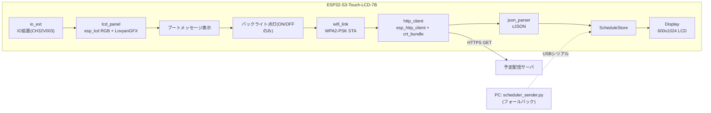

# 仕様

ESP32-S3-Touch-LCD-7Bに表示する内容と、そこへ至るまでの処理の仕様。
ビルドや書き込みの手順は[README.md](../README.md)を参照。

## 動作の流れ



1. IO拡張チップを初期化し、LCDパネル(esp_lcd RGB + LovyanGFX)を初期化する
2. シリアル(UART0)の受信待受を開始する(フォールバックの`REQ:ALL`/`EVENT:*`用)
3. `font`パーティションのTTFをFreeTypeで開く。開けない場合は起動を止め、
   内蔵フォントでエラーだけ表示する
4. ブートメッセージを表示してからバックライトを点灯する
   (IO拡張チップ(CH32V003)のPWMレジスタで輝度の段階調光ができる。
   **RTCを搭載していないため、この時点では時刻は不明。** 表示はブートメッセージのまま)
5. Wi-Fi(STA)でAPへ接続する。`secrets.h`に定義した複数候補(最大3件、候補ごとに
   固定IP/DHCPを切り替えられる)を順に試す。まず起動直後にブロッキングスキャンを行い、
   実際に見えている候補を定義順のまま優先し、見えなかった候補(ステルスSSID)も
   定義順のまま後回しで試す。候補1つあたりの接続待ちは15秒。全候補が失敗すると
   `wifiLinkBegin()`はタイムアウトを返す。接続確立後にAPから切断された場合は
   同じAPへの再接続を8回まで試み、別候補への切り替えは行わない
   (切り替えたい場合は再起動が必要)
6. `SCHEDULE_URL`へHTTPS GETし、返ってきたJSONを`json_parser`でパース。
   時刻をサーバ側の値(JSON本文 → `Date`ヘッダの順)でシステムクロックに合わせる
   (RTCが無いためシステムクロックへの反映のみ。書き戻し先は無い)
7. 12時間分のタイムラインを描画する
8. 以降は**壁時計の`POLL_INTERVAL_SEC`境界**(既定300秒 = X:00 / X:05 / X:10…)で6〜7を繰り返す。
   起動時刻からの相対ではないので、更新時刻は毎回同じ分になる
9. 取得成否に関わらず、毎秒ヘッダーの時計を部分更新し、毎分タイムライン全体を描き直す
   (内容が前回と同一ならスキップ)。予定の強調段階が変わった直後は該当枠だけ5秒間・2Hzで明滅する

Wi-Fi接続または取得に失敗した場合は、USBシリアル経由の受信を待ち受けます(フォールバック)。
起動から初回取得成功までは時刻が不明なため、タイムラインは描画せずブートメッセージのまま待ちます。

## タッチによる画面ON/OFF

タッチIC(GT911)を使い、画面の点灯/消灯をタップで切り替えます。座標は使わず、
画面全体を1つの受付領域として押されているかどうかだけを見ます。ON/OFFは
`ioExtSetBacklight()`によるバックライトの点灯/消灯だけで行い、RGBパネル自体は
常に動かし続けます。したがって画面がOFFの間も、予定取得・時刻更新・タイムラインの
再描画は通常どおり継続します(単に見えていないだけです)。

- **画面ON中に1500ms(`TOUCH_LONG_TAP_MS`)以上のロングタップで画面をOFFにします。**
  短いタップ(タップダウンのみ)は何もしません。
- **画面OFF中は、押した瞬間(タッチダウン)で画面をONにします。** ロングタップである
  必要はありません。

### 誤動作対策

1回のタッチ(押してから離すまで)で画面が2度切り替わらないよう、以下を満たします。

- ロングタップで画面をOFFにした直後、指を離す前に再度ONへ戻ることはありません
  (タッチダウンの検出は「離れて→再度触れた」ときにしか起きないため)。
- 画面OFF中にタップダウンでONにした場合、そのまま指を離さずに1500ms以上ホールドしても、
  そのホールドがロングタップとして扱われて即座にOFFへ戻ることはありません
  (`main.cpp`の`suppress_longtap`フラグが、ONにした直後の同一タッチのロングタップ判定を
  無視します。次の新しいタッチからは通常どおりロングタップが効きます)。

### 現状(未解決)

**ロングタップで消灯しきれない。** バックライトのPWM(レジスタ`0x05`)は効いており
輝度は変わるが、255を書いても完全には消えず「少し暗くなる」だけになる。
完全な消灯にはDISP(IO2)をLowにする必要があるとみられるが未実装・未検証。

実装は`main/touch.cpp`(GT911の読み出しとタップ/ロングタップの状態機械)と
`main/main.cpp`(画面ON/OFFの実際の切り替えと誤動作対策)に分かれています。
GT911のI2Cバス共有・アドレスなどハードウェア寄りの背景は
`docs/implementation-notes.md`の決定事項16を参照してください。

## ダミー予定の表示(一時的)

社内サーバ(`SCHEDULE_URL`)へ到達できない環境で画面を確認するための暫定手段です。
`serial_link` / `protocol` / `pc_python`と同じ扱いのフォールバックで、**サーバへの
到達性が確認できたら`main/dummy_schedule.cpp/.h`と`main/sntp_time.cpp/.h`ごと撤去します。**

切り替えは`main/secrets.h`の`USE_DUMMY_SCHEDULE`マクロで行います
(`secrets.h`はgit追跡外なので、この切り替え自体は差分に現れません)。1のときは
`fetchSchedule()`がHTTP GETを一切行わず、`main/dummy_schedule.cpp`の
`dummyScheduleJson()`が`now_utc`基準の相対時刻で組み立てたJSONを直接`parseScheduleJson()`
へ渡します。件名の先頭には必ず`[ダミー]`が付き、ダミー表示中であることが画面上で常に
分かるようにしています。

RTCが無く、通常はサーバ応答のHTTP Date(またはJSON本文)から時刻を得ているため、
ダミーモードではその時刻源がありません。そこで**ダミーモードのときだけ**、Wi-Fi接続
成功直後に`main/sntp_time.cpp`の`sntpSyncTime()`でSNTP(既定`pool.ntp.org`、
`secrets.h`の`SNTP_SERVER`で変更可)から実時刻を取得してシステムクロックに反映します。
通常モードでは従来どおりHTTP Dateヘッダ(またはJSON本文)のみを使い、SNTPは呼びません。

`main/dummy_schedule.cpp`の`dummyScheduleJson()`は、専用のデモコードを持たず、
既存の強調・明滅の仕組み(`emphasisLevel()`の閾値`EMPH_L1_SEC`/`EMPH_L2_SEC`/`EMPH_L3_SEC`)を
そのまま踏ませる形で、`now_utc`基準の開始時刻を各しきい値の直前に置いています。

| # | 内容 | 開始(`now_utc`起点) |
|---|---|---|
| 1 | 進行中の予定 | -1800秒 〜 +1800秒 |
| 2 | L3(赤、開始2分前以下)の確認用 | +110秒 〜 +2600秒 |
| 3 | L2(橙、開始5分前以下)の確認用 | +280秒 〜 +3000秒 |
| 4 | L1(黄、開始10分前以下)の確認用 | +580秒 〜 +3400秒 |
| 5 | 遠い時間帯の予定(12時間タイムラインの見た目確認用) | +21600秒 〜 +25200秒 |
| 6 | さらに遠い予定 | +36000秒 〜 +39600秒 |
| 7 | 中止済み(除外経路の確認用) | +7200秒 〜 +9000秒 |
| 8 | 終日(除外経路の確認用) | その日のUTC日境界 |

2〜4は開始時刻が重なるように意図して配置しており、`layoutEvents()`の列分割(横に並べる処理)も
同時に確認できます。重なりを避ける方向には調整していません。

## 通信プロトコル(サーバ → デバイス)

`SCHEDULE_URL`へ`Accept: application/json`付きでGETし、200番のJSONを解釈します。
リダイレクトは追いません(3xxが返った場合は認証が要る状態としてログに`Location`を出します)。

TLSはESP-IDF同梱の公的CAバンドル(`esp_crt_bundle`)で検証します。アプリへの証明書の
埋め込みはしていません。

実スキーマは判明しており、`json_parser.cpp`をホスト上でこのレスポンスに当てて
検証済みです(件名・開始・終了・場所の対応、`+09:00`からUTCへの換算、UTF-8の日本語)。

```json
{
  "userId": "a1055258", "userName": "...", "date": "2026-08-31", "count": 10,
  "events": [
    { "subject": "JMIS朝会(AEC)",
      "start": "2026-08-31T09:00:00+09:00", "end": "2026-08-31T09:30:00+09:00",
      "isAllDay": false, "isCancelled": false,
      "location": "Microsoft Teams 会議", "body": "(数KBの定型文。読み捨てる)" }
  ]
}
```

`body` / `bodyPreview`はTeamsの定型文で1件あたり数KBあるため読み捨てます。
ルートに現在時刻のフィールドが無いので、時刻はHTTPの`Date`ヘッダから取ります。

**表示対象から外す予定**

| 条件 | 理由 |
|---|---|
| `isCancelled: true` | 中止された会議を表示しない |
| `isAllDay: true` | 00:00〜翌00:00の24時間枠として返るため、12時間タイムラインを丸ごと潰す |
| `showAs: "free"` | 空き時間(OutlookのBusyStatus 0相当)を表示しない |

`showAs: "tentative"`(仮の予定、BusyStatus 1相当)は除外せず表示します
(枠線を破線にし、明滅はさせません。詳細は「画面表示」章を参照)。

除外件数は解析失敗とは別に数えます。全件が除外されただけの日は「予定0件」として
成功扱いにし、前回の表示を消して空のタイムラインを描きます。

なお`json_parser.cpp`は下表のとおり複数のキー名を受け付ける実装のままにしてあります。
APIの仕様変更に対する保険で、1つに削っても動作は変わりません。

| 位置 | 受け付けるキー |
|---|---|
| イベント配列 | ルートが配列 / `events` / `value` / `items` / `data` / `schedule` / `schedules` / `appointments` |
| 件名 | `subject` / `title` / `name` / `summary` |
| 開始 | `start` / `startTime` / `start_time` / `startDateTime` / `begin` |
| 終了 | `end` / `endTime` / `end_time` / `endDateTime` / `finish` |
| 場所 | `location` / `place` / `room` / `locationName` |
| 現在時刻 | `now` / `serverTime` / `currentTime` / `timestamp` |

時刻の値は次のいずれでも構いません。

- `"2026-08-31T09:00:00Z"` / `"2026-08-31T09:00:00+09:00"` / `"2026-08-31 09:00:00"`
- `1756598400`(epoch秒。1e11を超える値はミリ秒とみなす)
- `{ "dateTime": "2026-08-31T00:00:00.0000000", "timeZone": "UTC" }`(Microsoft Graph形式)

オフセットが書かれていない文字列はUTCとして扱います。`timeZone`に`Tokyo`または`Asia/Tokyo`が
含まれる場合のみJST(UTC+9)として解釈します。

## 通信プロトコル(PC → デバイス、フォールバック)

```
NOW:{utc_epoch}
EVENT:CLEAR
EVENT:ADD\t{start_utc}\t{end_utc}\t{title}\t{location}
...
EVENT:FINISH
```

- `NOW:` … 現在時刻(UTC epoch秒)。デバイスのシステムクロック同期に使用(RTC非搭載のためRTCへの書き戻しは無い)
- `EVENT:CLEAR` … 受信時点で保持している予定データを即座にクリア
- `EVENT:ADD` … 予定を1件追加(タブ区切り)
- `EVENT:FINISH` … 受信完了の合図。これを受けてのみ画面を再描画する

デバイス → PC:

```
REQ:ALL
```

起動時に送信し、全予定の再送を要求する。

デバイスの`ESP_LOG*`出力はUART0ではなくUSB-Serial/JTAG(ネイティブUSB、COM4)へ出ます。
UART0(USB-TO-UARTポート)はPC側との`REQ:ALL`/`EVENT:*`プロトコル専用です。
当初は同じUART0にログとプロトコルを乗せていましたが、COM4は接続してからでないと
初期化されない仕様のため、UART0を主コンソールにすると監視を開いても無音になり、
実機のログが一切取得できませんでした(2026-09-12に確認)。

## 画面表示

### フォント

**フラッシュ上の`font`パーティション(0x610000、2MB、data/0x40)に生のまま書き込んだ
TTFをFreeTypeで描画します。SDカードは使いません(`sd_card.cpp`は削除済み)。**
使用フォントは`MPLUS1-Medium.ttf`([M PLUS 1](https://mplusfonts.github.io/)のMedium、ウェイト500)。
ビルド時にリポジトリの`fonts/MPLUS1-Medium.ttf`が`build/font.bin`へコピーされ、
`idf.py flash`実行時に他のイメージと一緒に自動で書き込まれます(`build/flash_args`に含まれる)。
`main/font_ttf.cpp`が`esp_partition_mmap`で`font`パーティションをメモリへマップし、
`FT_New_Memory_Face`で開きます。

| 用途 | サイズ |
|---|---|
| 起動メッセージ | 46px |
| 日付・曜日 | 34px |
| 時刻目盛 | 20px |
| 時計(ヘッダー右) | 56px |
| 予定ボックス | 14px |

**TTFが読めないとき(パーティションが空、フォーマット不正)は起動を停止します。**
内蔵のビットマップフォント(`efontJA_24_b`)へ退避すると輪郭が粗くて予定を読み取れないため、
中途半端に動かさず画面にエラーを出して止めます(`main/display.cpp`の`showFatalMessage()`)。
原因は`ESP_LOGE`に出ます。

#### グリフのラスタライズキャッシュ

実機計測(2026-09-12)で、タイムライン全体の再描画604msのうち文字の内訳は
FreeTypeのラスタライズが203ms、実際の転送(`pushImage()`)は23msでした。
そこで`fontTtfDrawText()`/`fontTtfTextWidth()`が(文字コード, ピクセルサイズ)を
キーにした汎用のグリフキャッシュを持ち、同じ文字を再描画のたびにFreeTypeで
作り直さないようにしています(`main/font_ttf.cpp`)。時計表示用の
既存キャッシュ(`fontTtfCacheGlyphs()`/`fontTtfDrawCachedText()`、使う文字集合を
明示的に事前キャッシュする方式)とは別の仕組みで、両方が共存します。

- カバレッジ配列(アンチエイリアスの濃淡)は、PSRAM上に一括確保した512KBの
  アリーナへ先頭詰めで格納します。小さな確保を大量に行うとヒープが
  断片化するためです。
- アリーナの確保(`heap_caps_malloc(MALLOC_CAP_SPIRAM | MALLOC_CAP_8BIT)`)に
  失敗した場合は、キャッシュを使わず従来どおり毎回`FT_Load_Char`で
  ラスタライズする経路にフォールバックします(機能は止まりません)。
  以後の再試行は行いません。
- アリーナが満杯になった場合は、LRUのような仕組みは入れず、キャッシュ
  全体を破棄して先頭から作り直します(`ESP_LOGW`を1行出します)。
  日本語の件名は文字種が多く、満杯になり得ます。

### 表示する予定の条件

サーバが返した予定のうち、次のものは表示しません(`main/json_parser.cpp`)。
除外した件数は解析失敗と分けて数え、`6件を取り込んだ(除外1件 / 解析不能0件)`の形でログに出ます。

| 条件 | 判定に使うフィールド |
|---|---|
| 中止済み | `isCancelled` |
| 終日予定 | `isAllDay`(00:00〜翌00:00の24時間枠になり12時間分の画面を潰すため) |
| 空き | `showAs`が`free`(OutlookのBusyStatus 0相当) |

空きを外したときは`空きとして除外: showAs=free`のように根拠を出します。
予定が消える方向の判定なので、黙って落とさないためです。

`showAs`が`tentative`(BusyStatus 1相当、仮の予定)は表示対象です。ただし確定の予定と
区別できるよう、枠線を破線(実線8px/隙間5pxの周期、`main/display.cpp`の
`dashRoundRectEdges()`)にし、強調段階(L1〜L3)に入っても明滅させません
(`Event::is_tentative`、詳細は後述の「予定の強調明滅」を参照)。取り込み時は
`仮の予定として取り込み(明滅なし): showAs=tentative`のようにログへ出します。

### 件名・場所の正規化

表示前に`main/text_util.cpp`で次を行います。

- 全角スペース(U+3000)を半角スペースにする
- 全角英数記号(U+FF01〜U+FF5E)を半角にする
- 半角カナ(U+FF61〜U+FF9F)を全角カナにする(濁点・半濁点は合成)
- 前後の空白を落とす

### 画面レイアウト

論理解像度600×1024の縦長表示(基板は横1024×600のパネルを90度回して使う。
回転は描画用スプライト(`Display::_canvas`)側の`setRotation(LCD_ROTATION)`で
指定する。`LGFX_Device`(`main/lcd_panel.cpp`)自体は回転なし(生の1024×600)の
まま使う。`1`と`3`のどちらが正しいかは**未検証**)。ダークテーマ。

**領域構成**

| 領域 | Y範囲(概算) | 内容 |
|---|---|---|
| ヘッダー | 0〜76px | 左に日付・曜日(34px)、右に時計(56px、`HH:MM:SS`) |
| 時刻ラベル列 | ヘッダー下、幅60px | 表示窓内の時刻目盛 |
| タイムライン | ヘッダー下〜画面下端 | 予定枠、現在時刻線、時刻線 |

**ヘッダーは本体と同じ背景色にし、下端の区切り線1本だけで本体と分ける**
(面で背景色を分けるとヘッダーだけ浮いて見えるため、専用の背景色は使わない)。
日付・曜日は小さく左に、時計は大きく右に置き、主従をはっきりさせる。
日付の書式は`9月12日(金)`(月日はゼロ埋めしない。`main/time_util.h`の`formatDate()`)。

表示窓は`now-1時間`〜`now+11時間`の12時間分。**現在時刻線は常にヘッダー下約79px
(画面上端から1時間ぶんの位置)に固定**され、時刻目盛と予定枠がその下から連続的に
スクロールする(1分あたり約1.3px)。1時間ごとの時刻線のみを引く
(12時間表示では間隔が狭くなるため30分の補助線は廃止した)。

**予定枠**: 角丸矩形。塗り+枠線の上に件名、枠の高さに余裕があれば場所も表示する。
進行中の予定は左端に緑の帯を出す。内側余白は上4px・左8px(進行中は帯の幅6pxを
加えた14px)、件名と場所の行間は2px(実機で縦が狭く2行が入りきらなかったため、
横より縦を詰めている)。列(横)方向の隣接する予定枠との間隔は左右3pxずつ
(計6px)、時間(縦)方向は隣接する予定枠との間に2pxの隙間を空ける。

**仮の予定(`showAs: "tentative"`)の枠は破線にする**(実線8px/隙間5pxの周期。
角の丸み部分は実線のまま残し、上下左右の直線部分だけを塗り色で上書きして隙間を
作る。`main/display.cpp`の`dashRoundRectEdges()`)。確定の予定と一目で区別できる
ようにするための表示で、強調段階(L1〜L3)に入っても明滅はさせない。

**現在時刻線**: 赤2pxの水平線+左端に丸印。

**色(RGB888)**

| 用途 | 色 |
|---|---|
| 背景(ヘッダー含む) | `0x121212` |
| 文字 | `0xE8E8E8` |
| 補助文字 | `0x9E9E9E` |
| 時刻線 | `0x3A3A3A` |
| 区切り | `0x505050` |
| 現在時刻線 | `0xFF5252` |
| 予定枠の塗り | `0x263B52` |
| 予定枠の枠線 | `0x5B8DB8` |
| 予定枠の文字 | `0xFFFFFF` |
| 進行中の帯 | `0x4CAF50` |
| 強調L1(10分前) | `0xFFD54F` |
| 強調L2(5分前) | `0xFF9800` |
| 強調L3(2分前) | `0xF44336` |

**予定の強調(開始が近いほど段階が上がる)**

| 段階 | タイミング | 枠線 | 太さ |
|---|---|---|---|
| L1 | 開始10分前 | 黄(`0xFFD54F`) | 3px |
| L2 | 開始5分前 | 橙(`0xFF9800`) | 3px |
| L3 | 開始2分前 | 赤(`0xF44336`) | 3px |

段階が変わった瞬間(取得で新しく現れた予定が既に10分以内の場合も含む)は、該当予定枠だけ
**5秒間・2Hzで明滅**する(塗りを枠色に、文字を黒に反転)。開始後は通常表示に戻る。
どの予定を指すかは開始時刻+件名のFNV-1aで判定する。明滅は該当矩形だけの部分更新で行う。
明滅の開始は検出した瞬間ではなく`BLINK_START_DELAY_MS`(5秒)だけ遅らせる。理由は
下記「更新頻度」の優先順位を参照。

**仮の予定(`Event::is_tentative`)は強調段階に入っても明滅の対象にしない。**
枠色の変化と破線枠だけで強調・区別を示す。

**更新頻度**

タイムライン全体の再描画(画面全体を書き直す重い処理)が毎分00秒ちょうどに走ると、
時計の部分更新までその後回しになり、画面が一瞬止まって見える。これを避けるため、
`main.cpp`のメインループは毎ティック次の優先順位で処理する。

1. **時計** — 毎秒、無条件に最優先で更新する(部分更新なので軽い)。
2. **タイムライン全体の再描画** — 分が変わった直後・取得成功時・シリアル受信完了時に
   必要になるが、実際に描くのは**その分の秒=`TIMELINE_REDRAW_SEC`(5秒)に達してから**
   にずらす(`timeline_dirty`フラグで保留する)。取得は`X:00`境界に揃えているため、
   取得成功時も同様に00秒を避けて5秒へ遅らせる。ただし起動直後の初回描画だけは
   待たせないよう即座に描く。
3. **予定の強調明滅** — 段階が変わった瞬間からではなく`BLINK_START_DELAY_MS`(5秒)後、
   つまり毎分およそ10秒あたりから開始する。タイムライン再描画(5秒)と時間帯が
   重ならないようにするため。仮の予定(`is_tentative`)は対象外。

| 対象 | タイミング | 更新範囲 |
|---|---|---|
| 時計(ヘッダー右) | 毎秒(最優先) | ヘッダー右の矩形のみ。表示は`HH:MM:SS`(点滅なし。数字・コロンのグリフは起動時にラスタライズしてキャッシュ) |
| タイムライン全体 | 分が変わるごと・取得成功時・シリアル受信完了時(ただし実描画は毎分5秒へ遅延。初回のみ即時) | 画面全体(内容が前回と同一ならスキップ) |
| 予定の強調明滅(仮の予定を除く) | 段階が変わった約5秒後(毎分およそ10秒あたり)から5秒間 | 該当予定枠の矩形のみ |

描画はPSRAM上の`LGFX_Sprite`(パネルと同じ生の向き1024×600 RGB565、約1.2MB)へ行い、
`pushSprite()`でフレームバッファへ転送する。スプライトには`setRotation(LCD_ROTATION)`を
掛けており、描画コードは論理座標(600×1024)のまま書ける。パネルとスプライトの向きを
揃えているのは、向きが食い違うと`pushSprite()`が90度回転を伴う転送になり、実測で
全画面転送が832ms(タイムライン全体の再描画1173msの71%)掛かっていたため。
部分更新は転送先(`_gfx`、回転なし)に`setClipRect()`を掛けてから`pushSprite()`するが、
`_gfx`は生座標系のため、`Display::pushRect()`が論理座標(x, y, w, h)を
`nx = SCR_H - (y + h)`、`ny = x`、`nw = h`、`nh = w`という式(LovyanGFXの回転1相当の
変換)で生座標へ直してから`setClipRect()`に渡す。呼び出し側は常に論理座標を渡せばよい。

### 描画時間オーバーレイ(一時的なデバッグ表示)

`Display::setPerfOverlay(true)`を呼ぶと、`renderTimeline()`実行後に画面左下へ
`R:{ms}ms P:{ms}ms`(Rは`renderTimeline()`全体、Pは`pushSprite()`だけ)を14pxで
小さく表示する。ログが取れない環境で描画時間を実測するための手段で、
`main.cpp`では`USE_DUMMY_SCHEDULE`のときだけ有効にしている。

- 前回と画面内容が完全一致して何も描かない経路(署名一致)では計測も表示も行わない
  (計測値を壊さないため)。
- オーバーレイ自体の描画・転送にかかる時間は計測対象に含まない。
- **撤去条件**: 回転まわりの高速化など、描画性能の作業が一段落し実測が不要になった時点で
  `Display::setPerfOverlay()`呼び出しと`drawPerfOverlay()`ごと削除する。

### スクリーンショット出力(一時的なデバッグ機能)

こちらからデバイスの画面を確認する手段が無いため、`Display::dumpScreenshot()`は
スプライトの内容を縦横それぞれ1/2に間引いた300×512のRGB565として、1行ずつ
Base64化して`ESP_LOG*`(`SHOT`で始まる行)へ出す。`main.cpp`では
`USE_DUMMY_SCHEDULE`のときだけ、最初のタイムライン描画から20秒後に1回だけ呼ぶ。

- 出力形式: `SHOT BEGIN 300 512` → `SHOT <行番号0〜511> <Base64>`を512行 →
  `SHOT END`
- 論理座標(x, y)は`Display::pushRect()`の回転1変換をw=h=1に当てはめた
  `index = x * LCD_PHYS_W + (SCR_H - 1 - y)`でスプライトの生バッファから直接読む
  (スプライトは生の向き1024×600で確保し、論理座標は600×1024のため)
- ホスト側では`tools/screenshot.py`が`logs/monitor.log`から`SHOT`行を拾い、
  RGB565→RGB888へ展開してPNG(zlib圧縮)に復元する
- **撤去条件**: サーバ到達性が確認でき、ダミーモード自体
  (`main/dummy_schedule.cpp/.h`、`main/sntp_time.cpp/.h`)が撤去できる時点で、
  `Display::dumpScreenshot()`と`tools/screenshot.py`ごと削除する

### 時刻管理

- RTCチップは搭載していない。時刻はサーバ応答(JSON本文 → `Date`ヘッダの順)で
  システムクロックに合わせるのみで、書き戻し先(RTC)は無い
- `main/time_util.h` の `JST_OFFSET`(+9時間)でUTC⇔JSTを変換
  (libcのTZは`app_main()`で`UTC0`に固定している)
- **起動直後は時刻が不明。** 初回の取得が成功するまでシステムクロックは合っていないため、
  画面はブートメッセージのまま待つ
- クロックのドリフトは`POLL_INTERVAL_SEC`(既定300秒)ごとの取得成功時にサーバ時刻へ
  合わせ直すことで補正される。RTCによる保持は無いため、取得が長時間失敗し続けると
  時刻はESP32-S3内蔵クロックの精度に依存する
