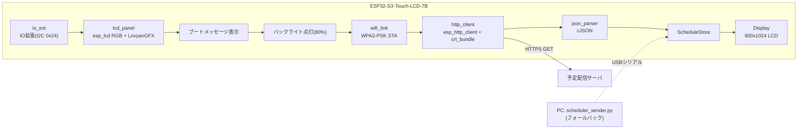

# 仕様

ESP32-S3-Touch-LCD-7Bに表示する内容と、そこへ至るまでの処理の仕様。
ビルドや書き込みの手順は[README.md](../README.md)を参照。

## 動作の流れ



1. IO拡張チップを初期化し、LCDパネル(esp_lcd RGB + LovyanGFX)を初期化する
2. シリアル(UART0)の受信待受を開始する(フォールバックの`REQ:ALL`/`EVENT:*`用)
3. `font`パーティションのTTFをFreeTypeで開く。開けない場合は起動を止め、
   内蔵フォントでエラーだけ表示する
4. ブートメッセージを表示してからバックライトを80%で点灯する
   (**RTCを搭載していないため、この時点では時刻は不明。** 表示はブートメッセージのまま)
5. Wi-Fi(STA)でAPへ接続する
6. `SCHEDULE_URL`へHTTPS GETし、返ってきたJSONを`json_parser`でパース。
   時刻をサーバ側の値(JSON本文 → `Date`ヘッダの順)でシステムクロックに合わせる
   (RTCが無いためシステムクロックへの反映のみ。書き戻し先は無い)
7. 6時間分のタイムラインを描画する
8. 以降は**壁時計の`POLL_INTERVAL_SEC`境界**(既定300秒 = X:00 / X:05 / X:10…)で6〜7を繰り返す。
   起動時刻からの相対ではないので、更新時刻は毎回同じ分になる
9. 取得成否に関わらず、毎秒ヘッダーの時計を部分更新し、毎分タイムライン全体を描き直す
   (内容が前回と同一ならスキップ)。予定の強調段階が変わった直後は該当枠だけ5秒間・2Hzで明滅する

Wi-Fi接続または取得に失敗した場合は、USBシリアル経由の受信を待ち受けます(フォールバック)。
起動から初回取得成功までは時刻が不明なため、タイムラインは描画せずブートメッセージのまま待ちます。

## 通信プロトコル(サーバ → デバイス)

`SCHEDULE_URL`へ`Accept: application/json`付きでGETし、200番のJSONを解釈します。
リダイレクトは追いません(3xxが返った場合は認証が要る状態としてログに`Location`を出します)。

TLSはESP-IDF同梱の公的CAバンドル(`esp_crt_bundle`)で検証します。アプリへの証明書の
埋め込みはしていません。

実スキーマは判明しており、`json_parser.cpp`をホスト上でこのレスポンスに当てて
検証済みです(件名・開始・終了・場所の対応、`+09:00`からUTCへの換算、UTF-8の日本語)。

```json
{
  "userId": "a1055258", "userName": "...", "date": "2026-08-31", "count": 10,
  "events": [
    { "subject": "JMIS朝会(AEC)",
      "start": "2026-08-31T09:00:00+09:00", "end": "2026-08-31T09:30:00+09:00",
      "isAllDay": false, "isCancelled": false,
      "location": "Microsoft Teams 会議", "body": "(数KBの定型文。読み捨てる)" }
  ]
}
```

`body` / `bodyPreview`はTeamsの定型文で1件あたり数KBあるため読み捨てます。
ルートに現在時刻のフィールドが無いので、時刻はHTTPの`Date`ヘッダから取ります。

**表示対象から外す予定**

| 条件 | 理由 |
|---|---|
| `isCancelled: true` | 中止された会議を表示しない |
| `isAllDay: true` | 00:00〜翌00:00の24時間枠として返るため、6時間タイムラインを丸ごと潰す |

除外件数は解析失敗とは別に数えます。全件が除外されただけの日は「予定0件」として
成功扱いにし、前回の表示を消して空のタイムラインを描きます。

なお`json_parser.cpp`は下表のとおり複数のキー名を受け付ける実装のままにしてあります。
APIの仕様変更に対する保険で、1つに削っても動作は変わりません。

| 位置 | 受け付けるキー |
|---|---|
| イベント配列 | ルートが配列 / `events` / `value` / `items` / `data` / `schedule` / `schedules` / `appointments` |
| 件名 | `subject` / `title` / `name` / `summary` |
| 開始 | `start` / `startTime` / `start_time` / `startDateTime` / `begin` |
| 終了 | `end` / `endTime` / `end_time` / `endDateTime` / `finish` |
| 場所 | `location` / `place` / `room` / `locationName` |
| 現在時刻 | `now` / `serverTime` / `currentTime` / `timestamp` |

時刻の値は次のいずれでも構いません。

- `"2026-08-31T09:00:00Z"` / `"2026-08-31T09:00:00+09:00"` / `"2026-08-31 09:00:00"`
- `1756598400`(epoch秒。1e11を超える値はミリ秒とみなす)
- `{ "dateTime": "2026-08-31T00:00:00.0000000", "timeZone": "UTC" }`(Microsoft Graph形式)

オフセットが書かれていない文字列はUTCとして扱います。`timeZone`に`Tokyo`または`Asia/Tokyo`が
含まれる場合のみJST(UTC+9)として解釈します。

## 通信プロトコル(PC → デバイス、フォールバック)

```
NOW:{utc_epoch}
EVENT:CLEAR
EVENT:ADD\t{start_utc}\t{end_utc}\t{title}\t{location}
...
EVENT:FINISH
```

- `NOW:` … 現在時刻(UTC epoch秒)。デバイスのシステムクロック同期に使用(RTC非搭載のためRTCへの書き戻しは無い)
- `EVENT:CLEAR` … 受信時点で保持している予定データを即座にクリア
- `EVENT:ADD` … 予定を1件追加(タブ区切り)
- `EVENT:FINISH` … 受信完了の合図。これを受けてのみ画面を再描画する

デバイス → PC:

```
REQ:ALL
```

起動時に送信し、全予定の再送を要求する。

なお、デバイスの`ESP_LOG*`出力も同じUART0に流れます。PC側は完全一致で`REQ:ALL`だけを
拾うため、ログが混ざっても動作に影響はありません。

## 画面表示

### フォント

**フラッシュ上の`font`パーティション(0x610000、2MB、data/0x40)に生のまま書き込んだ
TTFをFreeTypeで描画します。SDカードは使いません(`sd_card.cpp`は削除済み)。**
使用フォントは`MPLUS1-ExtraBold.ttf`([M PLUS 1](https://mplusfonts.github.io/)のExtraBold)。
ビルド時にリポジトリの`fonts/MPLUS1-ExtraBold.ttf`が`build/font.bin`へコピーされ、
`idf.py flash`実行時に他のイメージと一緒に自動で書き込まれます(`build/flash_args`に含まれる)。
`main/font_ttf.cpp`が`esp_partition_mmap`で`font`パーティションをメモリへマップし、
`FT_New_Memory_Face`で開きます。

| 用途 | サイズ |
|---|---|
| 起動メッセージ | 46px |
| 日付・時刻目盛 | 36px |
| 時計(ヘッダー右) | 40px |
| 予定ボックス | 22px |

**TTFが読めないとき(パーティションが空、フォーマット不正)は起動を停止します。**
内蔵のビットマップフォント(`efontJA_24_b`)へ退避すると輪郭が粗くて予定を読み取れないため、
中途半端に動かさず画面にエラーを出して止めます(`main/display.cpp`の`showFatalMessage()`)。
原因は`ESP_LOGE`に出ます。

### 表示する予定の条件

サーバが返した予定のうち、次のものは表示しません(`main/json_parser.cpp`)。
除外した件数は解析失敗と分けて数え、`6件を取り込んだ(除外1件 / 解析不能0件)`の形でログに出ます。

| 条件 | 判定に使うフィールド |
|---|---|
| 中止済み | `isCancelled` |
| 終日予定 | `isAllDay`(00:00〜翌00:00の24時間枠になり6時間分の画面を潰すため) |
| 空き・仮の予定 | `showAs`が`free` / `tentative`(OutlookのBusyStatus 0 / 1相当) |

空き・仮の予定を外したときは`空き/仮の予定として除外: showAs=free`のように根拠を出します。
予定が消える方向の判定なので、黙って落とさないためです。

### 件名・場所の正規化

表示前に`main/text_util.cpp`で次を行います。

- 全角スペース(U+3000)を半角スペースにする
- 全角英数記号(U+FF01〜U+FF5E)を半角にする
- 半角カナ(U+FF61〜U+FF9F)を全角カナにする(濁点・半濁点は合成)
- 前後の空白を落とす

### 画面レイアウト

論理解像度600×1024の縦長表示(基板は横1024×600のパネルを90度回して使う。
回転方向は`LGFX_Device`側の`LCD_ROTATION`で指定するが、`1`と`3`のどちらが正しいかは
**未検証**)。ダークテーマ。

**領域構成**

| 領域 | Y範囲(概算) | 内容 |
|---|---|---|
| ヘッダー | 0〜60px | 左に日付、右に時計(`HH:MM:SS`) |
| 時刻ラベル列 | ヘッダー下、幅70px | 表示窓内の時刻目盛 |
| タイムライン | ヘッダー下〜画面下端 | 予定枠、現在時刻線、時刻線、30分線 |

表示窓は`now-1時間`〜`now+5時間`の6時間分。**現在時刻線は常にヘッダー下約160px
(画面上端から1時間ぶんの位置)に固定**され、時刻目盛と予定枠がその下から連続的に
スクロールする(1分あたり約2.7px)。1時間ごとの時刻線に加えて、ラベルの無い30分線も引く。

**予定枠**: 角丸矩形。塗り+枠線の上に件名、枠の高さに余裕があれば場所も表示する。
進行中の予定は左端に緑の帯を出す。

**現在時刻線**: 赤2pxの水平線+左端に丸印。

**色(RGB888)**

| 用途 | 色 |
|---|---|
| 背景 | `0x121212` |
| ヘッダー背景 | `0x1E1E1E` |
| 文字 | `0xE8E8E8` |
| 補助文字 | `0x9E9E9E` |
| 時刻線 | `0x3A3A3A` |
| 30分線 | `0x262626` |
| 区切り | `0x505050` |
| 現在時刻線 | `0xFF5252` |
| 予定枠の塗り | `0x263B52` |
| 予定枠の枠線 | `0x5B8DB8` |
| 予定枠の文字 | `0xFFFFFF` |
| 進行中の帯 | `0x4CAF50` |
| 強調L1(10分前) | `0xFFD54F` |
| 強調L2(5分前) | `0xFF9800` |
| 強調L3(2分前) | `0xF44336` |

**予定の強調(開始が近いほど段階が上がる)**

| 段階 | タイミング | 枠線 | 太さ |
|---|---|---|---|
| L1 | 開始10分前 | 黄(`0xFFD54F`) | 3px |
| L2 | 開始5分前 | 橙(`0xFF9800`) | 3px |
| L3 | 開始2分前 | 赤(`0xF44336`) | 3px |

段階が変わった瞬間(取得で新しく現れた予定が既に10分以内の場合も含む)は、該当予定枠だけ
**5秒間・2Hzで明滅**する(塗りを枠色に、文字を黒に反転)。開始後は通常表示に戻る。
どの予定を指すかは開始時刻+件名のFNV-1aで判定する。明滅は該当矩形だけの部分更新で行う。

**更新頻度**

| 対象 | タイミング | 更新範囲 |
|---|---|---|
| 時計(ヘッダー右) | 毎秒 | ヘッダー右の矩形のみ(数字とコロンのグリフは起動時にラスタライズしてキャッシュ) |
| タイムライン全体 | 分が変わるごと・取得成功時・シリアル受信完了時 | 画面全体(内容が前回と同一ならスキップ) |
| 予定の強調明滅 | 段階が変わった瞬間から5秒間 | 該当予定枠の矩形のみ |

描画はPSRAM上の`LGFX_Sprite`(600×1024 RGB565、約1.2MB)へ行い、`pushSprite()`で
フレームバッファへ転送する。部分更新は転送先に`setClipRect()`を掛けてから`pushSprite()`する。

### 時刻管理

- RTCチップは搭載していない。時刻はサーバ応答(JSON本文 → `Date`ヘッダの順)で
  システムクロックに合わせるのみで、書き戻し先(RTC)は無い
- `main/time_util.h` の `JST_OFFSET`(+9時間)でUTC⇔JSTを変換
  (libcのTZは`app_main()`で`UTC0`に固定している)
- **起動直後は時刻が不明。** 初回の取得が成功するまでシステムクロックは合っていないため、
  画面はブートメッセージのまま待つ
- クロックのドリフトは`POLL_INTERVAL_SEC`(既定300秒)ごとの取得成功時にサーバ時刻へ
  合わせ直すことで補正される。RTCによる保持は無いため、取得が長時間失敗し続けると
  時刻はESP32-S3内蔵クロックの精度に依存する
